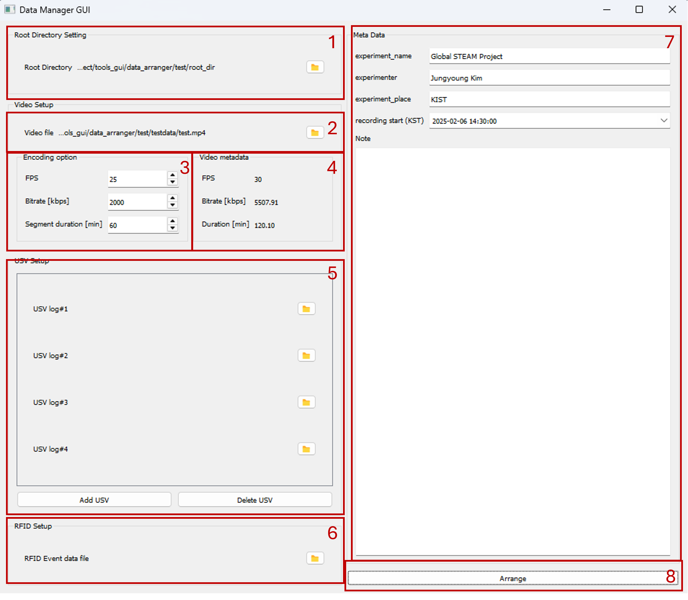

# Install program
1. Install python package
- 코드가 존재하는 디렉토리로 이동 (해당 디렉토리에는 datamanger 폴더와 setup.py 파일, README.md 파일이 존재해야 함)
```
>>> pip install .
```

2. Install ffmpeg ([reference](https://angelplayer.tistory.com/351))
    1) ffmpeg 사이트로 이동 (https://ffmpeg.org/)
    2) Download 버튼 클릭
    3) windows 선택
    4) 하단에 windows build from gyan.dev 클릭
    5) ffmpeg-git-full.7z 파일 다운로드
    6) 다운로드 후 압축 해제 
    6) 환경변수 편집으로 들어가서 PATH에 압축해제한 경로 입력
        - 예를 들어 Desktop에 풀어두었다면 Desktop/ffmpeg/bin/ 폴더 추가

# Run program & functions
- Open windows terminal
```
>>> python -m datamanager
```
아래와 같은 창 생성 (빨간 선 제외)



1) Root directory 선택 (항상 동일)
2) Video 파일 선택 (단일 파일 선택 가능)
3) Video encoding 옵션 선택
    - Bitrate (kbps): 높일수록 화질이 좋아지지만 비례햐여 용량이 커짐 (2000-5000 사이의 값을 추천)
    - Segment duration (min): 영상을 자르는 시간 단위; 원본 영상의 fps가 항상 동일하지는 않기에 수초 정도의 차이가 있을 수 있음.
4) Video metadata (video 파일 선택 시 자동으로 popup)
5) USV 파일 선택
    - log file을 선택 필요 (e.g. ch1.log)
    - 기본 4개 선택이 가능하며, 원하면 추가하거나 (Add USV) 뺄 수 있음 (Delete USV).
6) RFID 파일 선택
    - 추후 추가 예정
7) Experiment metadata (실험자가 입력)
    - experiment_name: 실험 이름 (e.g. Global STEAM Project)
    - experimenter: 실험자 이름 (e.g. John Doe)
    - experiment_place: 실험 장소 (e.g. 순천향대)
    - recording_start: recording 시작 시간 (!**video 시간 기준으로 적어줄 것**)
    - note: 기타 특이사항
8) Arrange
    - 모든 셋팅을 확인 후, 파일 정렬 시작


# File structure
- 전체적인 파일 구조는 다음과 같음.
```tree
root_dir
├───summary.xlsx
├───RAW_VIDEO
    ├───raw_250206T1430.avi
    ├───raw_250206T1531.avi
├───Data_250206T1430-250206T1531
    ├───meta.json
    ├───encoded_250206T1430.avi
    ├───usv
        └───usv_table.xlsx
        └───usv_table.sqlite
        └───usv0000000.wav
        └───usv0000001.wav
        └───usv0000002.wav
        └───usv0000003.wav
        ...
├───Data_250206T1531-250206T11630
    ├───meta.json
    ├───encoded_250206T1531.avi
    ├───usv
        └───usv_table.xlsx
        └───usv_table.sqlite
        └───usv0000000.wav
        └───usv0000001.wav
        └───usv0000002.wav
        └───usv0000003.wav
        ...
```

## RAW_VIDEO
- 원본 영상과 동일한 세팅에서, [Segment duration]간격으로 잘린 영상들이 저장됨. 기존의 영상도 보존되기에 실행 전에 반드시 저장장치 용량 확인 필요
- raw뒤의 숫자는 날짜-시간으로 예를 들어 250206T1430은 25년 2월 6일 14시 30분에 해당 (KST)

## summary.xlsx
- 전체 데이터셋에 대한 summary가 저장됨 (time_start, time_end, directory, is_video, is_usv, is_rfid, note)

## Data directory
### meta.json
- GUI에 입력한 정보가 각 데이터 폴더에 저장됨.

```bash
{
    "experiment_name": "Global STEAM Project",
    "experimenter": "Jungyoung Kim",
    "experiment_place": "KIST",
    "recording_start": "2025-02-06T14:30:00",
    "recording_end": "2025-02-06T15:31:03.360000",
    "note": "",
    "structure_version": "0.1.0",
    "is_video": true,
    "is_usv": false,
    "is_rfid": false,
    "project_dir": "Data_250206T1430-250206T1531",
    "encoding_info": {
        "width": 1920,
        "height": 1080,
        "fps": 25,
        "duration": 120.1,
        "codec": "h264",
        "bitrate": 2
    }
}
```

### encoded video (encoded_*)
- 잘린 원본 영상을 선택한 encoding option으로 인코딩된 영상. 뒤의 숫자는 raw video와 동일

### usv
- 여러 채널에서 Recording된 USV데이터들을 비디오 시간에 맞춰 정렬시킴
#### usv_table.xlsx
- 각 usv 파일 (file name)에 대해 recording time과 (date, time), 비디오 recording 시작 시간과의 차이 (time_delta), recording duration (dur), device ID (USV channel 1-4) 정보를 담고 있음. 
- 추후에 특정 시간에서 발생한 USV정보를 찾고 싶으면 해당 파일을 참조 

#### usv_table.sqlite
- usv_table.xlsx와 같은 정보를 담고 있는 sql 파일